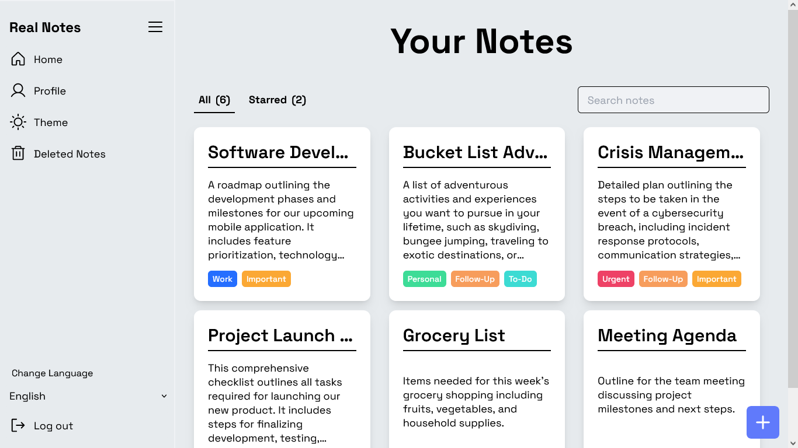

# Real Notes - Your Notes, Your Wish

A note-taking application with CRUD operations, authentication, profile management, multi-language support, and customizable themes.

## 🔮 Features

-   **📝 CRUD Features:** Create, Read, Update, and Delete notes easily.
-   **⭐ Star Notes:** Highlight important notes with stars for quick access.
-   **🔒 User Authentication:** Encourages secure authentication to protect user data.
-   **🔄 Profile Sync:** Syncs user profiles at login time to deliver a tailored experience.
-   **🏷️ Labels for Priority of Notes:** Places note**s with labels to show their top priority.
-   **🔍 Recovery Option for Deleted Notes:** Restore deleted notes from sync history.
-   **🌐 Multi-language Support:** Cater to various user needs with support for many languages.
-   **🌞🌚 Light and Dark Theme:** Toggle between light and dark themes for convenient use.
-   **👤 Profile Page:** Modify account settings like changing password, resetting password, and deleting an account.
-   **📱 Full Responsive:** Enjoy a seamless experience across all devices, ensuring accessibility and usability.

## 🚀 Live Preview

You can view the live preview of the project [here.](https://realnotes.netlify.app)

## 💻 Tech Stack

